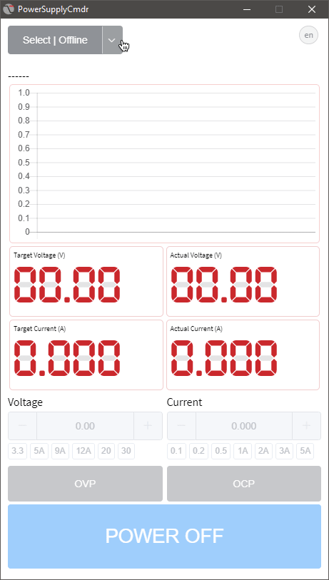

# Tenma Power Supply Commander

A TENMA like serial (USB) control DC power supply app.



## Features

- Live voltage and current reading
- Peak current capture
- Voltage and current preset buttons
- Translated (:blush: by Google)

## Protocol

Power supply uses Series Remote Control Syntax V2.0. Various branded supplies
use the same underlying command protocol so likely works beyond TENMA.

| Command         | Description                          | Example       |
| --------------- | ------------------------------------ | ------------- |
| ISET\<X>:\<NR2> | Sets the output current              | `ISET1:2.225` |
| ISET\<X>?       | Returns the output current setting   | `ISET1?`      |
| VSET\<X>:\<NR2> | Sets the output voltage              | `VSET1:20.0`  |
| VSET\<X>?       | Returns the output voltage setting   | `VSET1?`      |
| IOUT\<X>?       | Returns the actual output current    | `IOUT1?`      |
| VOUT\<X>?       | Returns the actual output voltage    | `VOUT1?`      |
| OUT\<NR1>       | Turns on (1) or off (0) the output   | `OUT1`        |
| STATUS?         | Returns the POWER SUPPLY status      | -             |
| \*IDN?          | Returns the 72-2685 identification   | -             |
| OCP\<NR1>       | Over current protection on(1) off(0) | `OCP1`        |
| OVP\<NR1>       | Over voltage protection on(1) off(0) | `OVP0`        |

Source [Farnell Element 14 (UK) Protocol V2.0 Datasheet](https://www.element14.com/community/docs/DOC-75108/l/protocol-information-for-tenma-72-2550-and-tenma-72-2535-qa-window-driver)

## Build Setup

Build from source flag is required due to node serial bindings no longer
maintained binary releases. Ensure Python 2.7 is in the path before Python 3.x!

```bash
# install dependencies
npm install --build-from-source

# serve with hot reload at localhost:9080
npm run dev

# build electron application for production
npm run build

# lint all JS/Vue component files in `src/`
npm run lint

```

---

> #electron, #vuejs, #elementui, #serialport,
